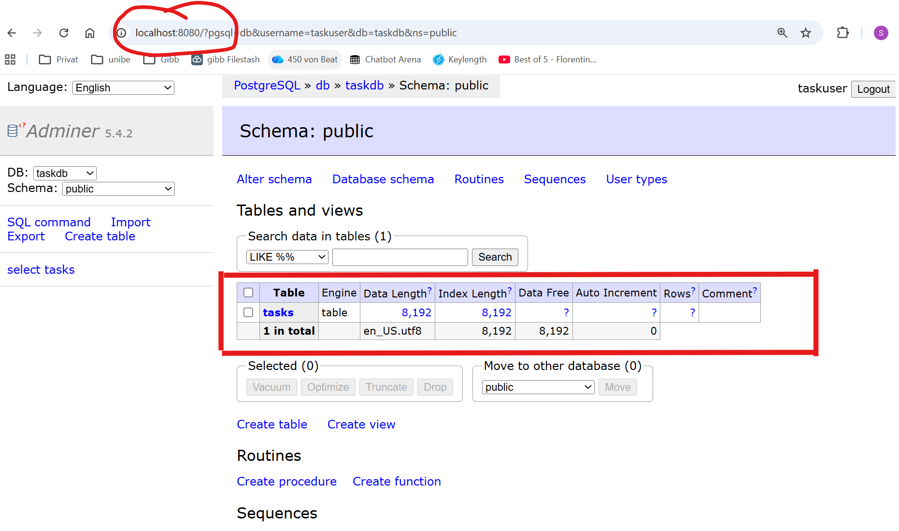
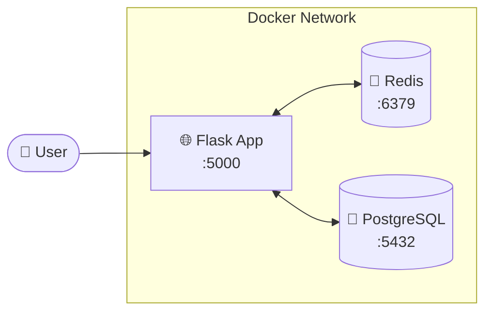
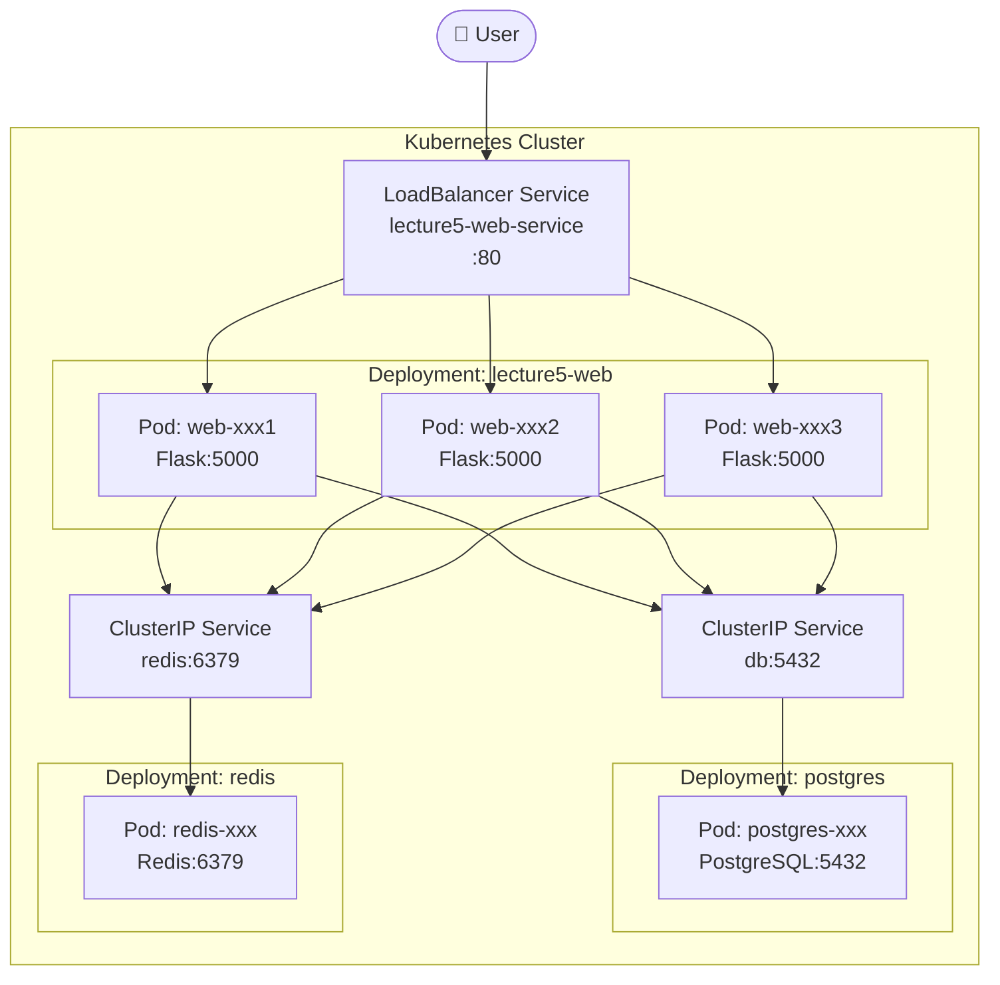
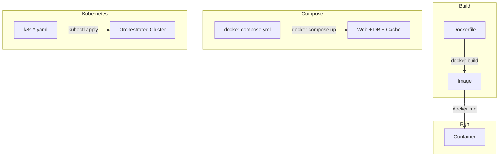

# Lecture 5: Bearbeitung Übungsblatt und Abgabe
## Summary
- [x] Forken Sie das Repository (Link siehe unten)
- [x] Bearbeiten Sie die Aufgaben in Ihrem Fork
– [x] Dokumentieren Sie Ihre Lösungen im README.md
– [x] Fügen Sie den Link zu Ihrem geforkten Repository im README hinzu

## Aufgabe 1: Modify the Docker Setup
### Take a screenshot showing the tasks table



# Lecture 5: Docker & Kubernetes Demo

> DevOps for Cyber-Physical Systems | University of Bern

A Task Manager app demonstrating Docker containerization and Kubernetes orchestration.

## Architecture

**Docker Compose:**


**Kubernetes:**


## Project Structure

```
lecture5-docker-demo/
├── app.py              # Flask application
├── Dockerfile          # Build instructions
├── docker-compose.yml  # Multi-service setup
├── k8s-backend.yaml    # K8s: PostgreSQL + Redis
├── k8s-web.yaml        # K8s: Web app deployment
├── test_load_balancing.py  # Load balancing test
├── templates/
│   └── index.html      # Web UI
└── assets/             # Logo images
```

---

# Part 1: Docker 🐳

## Quick Start with Docker Compose

```bash
# Start all services
docker compose up

# Open http://localhost:5000

# Stop
docker compose down
```

## Docker Commands Reference

| Command | Description |
|---------|-------------|
| `docker compose up` | Start all services |
| `docker compose down` | Stop all services |
| `docker compose down -v` | Stop + delete data |
| `docker compose logs -f` | View logs |
| `docker compose exec db psql -U taskuser -d taskdb` | Access database |
| `docker compose exec redis redis-cli` | Access Redis |

## Building Your Own Docker Image

**Option 1: Build yourself**
```bash
docker build -t YOUR-USERNAME/lecture5-webapp:v1.0 .
docker push YOUR-USERNAME/lecture5-webapp:v1.0
```

**Option 2: Use pre-built image**
```bash
# Use merabro/lecture5-webapp:v1.1 in your deployments
# Already built and available on Docker Hub
```

---

# Part 2: Kubernetes ☸️

## Prerequisites

Install Minikube for local Kubernetes:
- **Windows/Mac**: Enable Kubernetes in Docker Desktop Settings
- **All platforms**: Install Minikube from https://minikube.sigs.k8s.io/

## Step 1: Start Minikube

```bash
minikube start
```

<details>
<summary>Expected Output</summary>

```
😄  minikube v1.37.0 on Microsoft Windows 11
✨  Automatically selected the docker driver
👍  Starting "minikube" primary control-plane node in "minikube" cluster
🔥  Creating docker container (CPUs=2, Memory=7900MB) ...
🐳  Preparing Kubernetes v1.34.0 on Docker 28.4.0 ...
🔗  Configuring bridge CNI (Container Networking Interface) ...
🔎  Verifying Kubernetes components...
🌟  Enabled addons: storage-provisioner, default-storageclass
🏄  Done! kubectl is now configured to use "minikube" cluster
```
</details>

## Step 2: Build and Push Docker Image

```bash
# Build the image
docker build -t merabro/lecture5-webapp:v1.1 .

# Login to Docker Hub
docker login

# Push to Docker Hub
docker push merabro/lecture5-webapp:v1.1
```

<details>
<summary>Expected Output</summary>

```
[+] Building 9.2s (13/13) FINISHED
 => [1/7] FROM docker.io/library/python:3.11-slim
 => [2/7] WORKDIR /app
 => [3/7] COPY requirements.txt .
 => [4/7] RUN pip install --no-cache-dir -r requirements.txt
 => [5/7] COPY app.py .
 => [6/7] COPY templates/ templates/
 => [7/7] COPY assets/ assets/
 => exporting to image

The push refers to repository [docker.io/merabro/lecture5-webapp]
v1.1: digest: sha256:a827246ae97bcc39ab8930e90935690d71aec1bb54a46d92751b478fdd647481
```
</details>

## Step 3: Deploy Backend Services (PostgreSQL + Redis)

```bash
kubectl apply -f k8s-backend.yaml
```

<details>
<summary>Expected Output</summary>

```
persistentvolumeclaim/postgres-pvc created
deployment.apps/postgres created
service/db created
deployment.apps/redis created
service/redis created
```
</details>

Check backend pods:
```bash
kubectl get pods
```

<details>
<summary>Expected Output</summary>

```
NAME                        READY   STATUS    RESTARTS   AGE
postgres-5695fbfd64-mlcqw   1/1     Running   0          14s
redis-57566c54f6-nzbtj      1/1     Running   0          14s
```
</details>

## Step 4: Deploy Web Application

```bash
kubectl apply -f k8s-web.yaml
```

<details>
<summary>Expected Output</summary>

```
deployment.apps/lecture5-web created
service/lecture5-web-service created
```
</details>

Check all resources:
```bash
kubectl get deployments
kubectl get services
kubectl get pods
```

<details>
<summary>Expected Output</summary>

```
NAME           READY   UP-TO-DATE   AVAILABLE   AGE
lecture5-web   3/3     3            3           67s
postgres       1/1     1            1           101s
redis          1/1     1            1           101s

NAME                   TYPE           CLUSTER-IP       PORT(S)        AGE
db                     ClusterIP      10.99.17.144     5432/TCP       104s
kubernetes             ClusterIP      10.96.0.1        443/TCP        5m5s
lecture5-web-service   LoadBalancer   10.107.153.104   80:30262/TCP   70s
redis                  ClusterIP      10.99.151.191    6379/TCP       104s

NAME                           READY   STATUS    RESTARTS   AGE
lecture5-web-5c5d44c79-7zb57   1/1     Running   0          75s
lecture5-web-5c5d44c79-n4zx5   1/1     Running   0          75s
lecture5-web-5c5d44c79-qqqdx   1/1     Running   0          75s
postgres-5695fbfd64-mlcqw      1/1     Running   0          109s
redis-57566c54f6-nzbtj         1/1     Running   0          109s
```
</details>

## Step 5: Access the Application

```bash
minikube service lecture5-web-service
```

<details>
<summary>Expected Output</summary>

```
┌───────────┬──────────────────────┬─────────────┬────────────────────────┐
│ NAMESPACE │         NAME         │ TARGET PORT │          URL           │
├───────────┼──────────────────────┼─────────────┼────────────────────────┤
│ default   │ lecture5-web-service │             │ http://127.0.0.1:63501 │
└───────────┴──────────────────────┴─────────────┴────────────────────────┘
🏃  Starting tunnel for service lecture5-web-service.
🎉  Opening service default/lecture5-web-service in default browser...
```
</details>

The browser will automatically open to the app!

## Step 6: Demo - Scaling

Scale the web app from 3 to 5 replicas:

```bash
kubectl scale deployment lecture5-web --replicas=5
kubectl get pods
```

<details>
<summary>Expected Output</summary>

```
deployment.apps/lecture5-web scaled

NAME                           READY   STATUS    RESTARTS   AGE
lecture5-web-5c5d44c79-7zb57   1/1     Running   0          2m33s
lecture5-web-5c5d44c79-hjn25   1/1     Running   0          7s
lecture5-web-5c5d44c79-n4zx5   1/1     Running   0          2m33s
lecture5-web-5c5d44c79-qqqdx   1/1     Running   0          2m33s
lecture5-web-5c5d44c79-xtgp5   1/1     Running   0          7s
postgres-5695fbfd64-mlcqw      1/1     Running   0          3m7s
redis-57566c54f6-nzbtj         1/1     Running   0          3m7s
```
</details>

## Step 7: Demo - Rolling Update

Update the app to a new version:

```bash
kubectl set image deployment/lecture5-web web=merabro/lecture5-webapp:v1.1
kubectl rollout status deployment/lecture5-web
```

<details>
<summary>Expected Output</summary>

```
deployment.apps/lecture5-web image updated
Waiting for deployment "lecture5-web" rollout to finish: 1 old replicas are pending termination...
Waiting for deployment "lecture5-web" rollout to finish: 1 old replicas are pending termination...
deployment "lecture5-web" successfully rolled out
```
</details>

## Step 8: Test Load Balancing

Run the load balancing test:

```bash
# Install requests library
pip install requests

# Run test
python test_load_balancing.py
```

<details>
<summary>Expected Output</summary>

```
🚀 Testing load balancing across pods...
📍 Service URL: http://127.0.0.1:63501/info
🔄 Making 20 requests...

Request  1: Served by lecture5-web-dd74c46f6-c26t2
Request  2: Served by lecture5-web-dd74c46f6-jk2jm
Request  3: Served by lecture5-web-dd74c46f6-jk2jm
...
Request 20: Served by lecture5-web-dd74c46f6-jk2jm

============================================================
📊 LOAD BALANCING RESULTS
============================================================

Total successful requests: 20
Number of unique pods serving requests: 5

lecture5-web-dd74c46f6-9vpgq:  5 requests ( 25.0%) █████
lecture5-web-dd74c46f6-c26t2:  4 requests ( 20.0%) ████
lecture5-web-dd74c46f6-jk2jm:  4 requests ( 20.0%) ████
lecture5-web-dd74c46f6-pv2tc:  4 requests ( 20.0%) ████
lecture5-web-dd74c46f6-pmgjm:  3 requests ( 15.0%) ███

============================================================
✅ SUCCESS: Load balancing is working!
   Traffic distributed across 5 pods
============================================================
```
</details>

## Kubernetes Dashboard (Optional)

View your cluster in a web UI:

```bash
minikube dashboard
```

This opens a visual dashboard showing all your deployments, pods, services, and resource usage.

## Useful kubectl Commands

| Command | Description |
|---------|-------------|
| `kubectl get pods` | List all pods |
| `kubectl get deployments` | List all deployments |
| `kubectl get services` | List all services |
| `kubectl logs POD_NAME` | View pod logs |
| `kubectl describe pod POD_NAME` | Detailed pod info |
| `kubectl exec -it POD_NAME -- /bin/bash` | Shell into pod |
| `kubectl delete pod POD_NAME` | Delete pod (auto-recreates) |
| `kubectl scale deployment NAME --replicas=N` | Scale deployment |

## Cleanup

```bash
# Delete everything
kubectl delete -f k8s-web.yaml
kubectl delete -f k8s-backend.yaml

# Stop Minikube
minikube stop

# Delete Minikube cluster
minikube delete
```

---

## How It Works



**Dockerfile** → Recipe to build an image  
**Image** → Snapshot of your app + dependencies  
**Container** → Running instance of an image  
**Compose** → Run multiple containers together  
**Kubernetes** → Orchestrate containers at scale with auto-scaling, self-healing, load balancing

---

**University of Bern | DevOps for Cyber-Physical Systems**